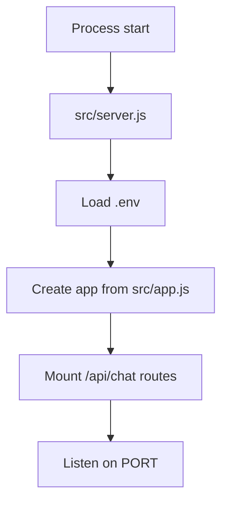
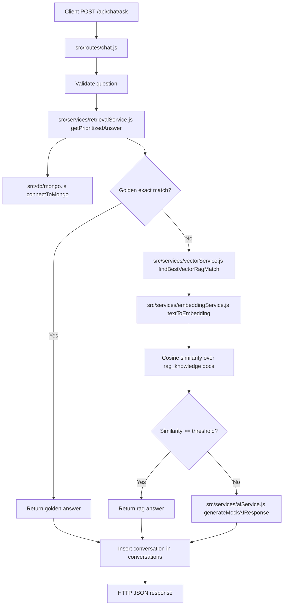
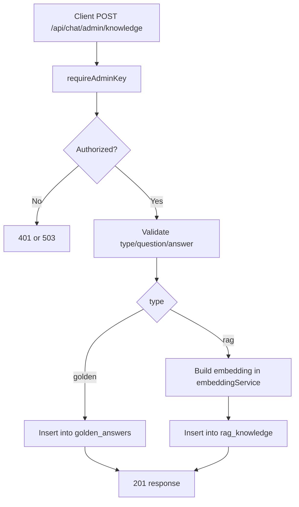
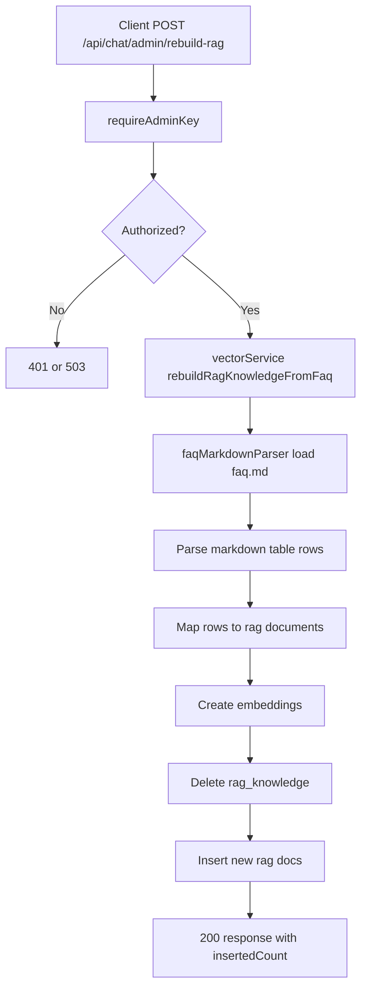

# Data Flow Overview

This document explains how data moves through the backend from user input to database access and final API response.

## 1. Runtime Entry and Routing

1. Server startup begins in src/server.js.
2. Environment variables are loaded with dotenv.
3. Express app is created from src/app.js.
4. The app mounts chat routes at /api/chat from src/routes/chat.js.
5. Static frontend assets are served from public/.

### Startup Flow

## 2. Shared Database Connection Layer

File: src/db/mongo.js

1. Loads .env explicitly for script execution safety.
2. Exposes connectToMongo() singleton-style connection reuse.
3. Exposes closeMongo() for script shutdown.
4. Exposes setDbForTests() for test injection.

Mongo collections used:
- golden_answers
- rag_knowledge
- conversations

## 3. Main User Query Flow: POST /api/chat/ask

Route handler: src/routes/chat.js

Input:
- JSON body with question

Output:
- JSON with question, source, answer, confidence, matchedQuestion (when available)

Detailed flow:

1. Route validates question.
2. Calls getPrioritizedAnswer(question) in src/services/retrievalService.js.
3. Retrieval service gets Mongo handle through connectToMongo().
4. Priority 1: exact/normalized lookup in golden_answers.
5. Priority 2: vector similarity lookup in rag_knowledge via src/services/vectorService.js.
6. Priority 3: fallback response from src/services/aiService.js.
7. Route writes conversation log into conversations.
8. Route returns API response to caller.

### Ask Request Flow

## 4. Vector Retrieval and Embedding Internals

### Normalization

File: src/services/retrievalServiceHelpers.js

- normalizeText(): canonical normalized text for indexing and matching.
- legacyNormalizeText(): compatibility path for older normalized values.

### Embedding Generation

File: src/services/embeddingService.js

- normalizeForEmbedding(): strips punctuation and normalizes spaces.
- textToEmbedding(): hashed bag-of-words vector of fixed size (default 256 dimensions), then L2 normalized.
- cosineSimilarity(): computes semantic closeness between query and document vectors.

### RAG Match

File: src/services/vectorService.js

1. Reads active documents from rag_knowledge.
2. Builds query embedding.
3. Compares query vector against each document embedding using cosine similarity.
4. Returns the top scoring answer if score >= RAG_SIMILARITY_THRESHOLD (default 0.28).

## 5. Admin Knowledge Insert Flow: POST /api/chat/admin/knowledge

Route handler: src/routes/chat.js

1. Validates x-admin-api-key with requireAdminKey().
2. Validates request body fields: type, question, answer.
3. For type=golden: writes to golden_answers.
4. For type=rag: computes embedding and writes to rag_knowledge.
5. Returns inserted id and payload summary.

### Admin Insert Flow

## 6. Admin RAG Rebuild Flow: POST /api/chat/admin/rebuild-rag

Route handler: src/routes/chat.js
Service: src/services/vectorService.js
Parser: src/db/faqMarkdownParser.js
Source file: faq.md

1. Requires valid admin API key.
2. Calls rebuildRagKnowledgeFromFaq(db).
3. Parser reads faq.md markdown table rows.
4. Converts each row into {question, answer, remarks}.
5. Service deletes existing rag_knowledge documents.
6. Service computes embeddings and bulk inserts rebuilt records.
7. Route returns insertedCount.

### RAG Rebuild Flow

## 7. Scripted Setup and Seeding Flow

### Database Initialization Script

File: src/db/initializeFAQ.js

1. Connects to Mongo.
2. Creates collections if missing with schema validators.
3. Creates indexes for retrieval and reporting.
4. Closes Mongo connection in finally block.

### FAQ Seed Script

File: src/db/seedFAQ.js

1. Connects to Mongo.
2. Calls rebuildRagKnowledgeFromFaq(db).
3. Loads faq.md as source of truth.
4. Rebuilds rag_knowledge with embeddings.
5. Closes Mongo connection in finally block.

## 8. Optional Service Layer Utilities

File: src/db/faqService.js

This service provides additional non-route helper operations for:
- adding FAQ entries
- category lookup
- keyword search
- updates
- conversation history retrieval

For RAG inserts, it also computes and stores embeddings.

## 9. End-to-End Data Summary

User question to output generation:

1. HTTP request enters /api/chat/ask.
2. Question is normalized and checked against golden_answers.
3. If no golden match, query embedding is generated and compared to rag_knowledge embeddings.
4. If a confident vector match exists, that answer is selected.
5. Otherwise fallback AI response is generated.
6. Final answer and source are persisted in conversations.
7. API returns JSON response to client.
